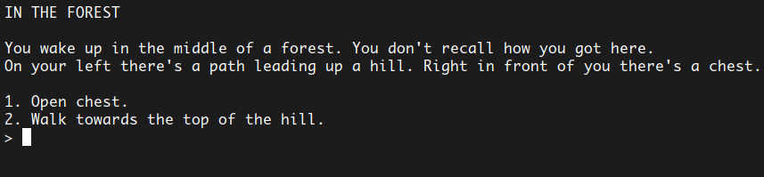

# INTERACTIVE FICTION

This is a simple game I made in python in which the player has to create and develop his own adventure by making all the decisions. 
The story will have a different ending every time you play. 
Feel free to change the story as you like. It is not a difficult operation. The instructions on how to do so are below. 

Check out the [C version](https://github.com/earendelmir/interactive-fiction-c) I made of this project.

&nbsp;

# How to play:
The following is an example of a scene you will find in the game:

+ Choose one of the possible actions listed above
+ Type its number
+ Press enter
+ Repeat

Eventually - by making all the right choices - you will ~~loose~~ win the game.

&nbsp;

# How to tweak the story:
In the source file you can find an array of _Scenes_; that is what you want to modify. 
Each _Scene_ has:
+ an **ID** 
a **_unique_** integer that identifies that particular scene.
+ a **TITLE** 
a string that will be printed right above the
+ **DESCRIPTION** 
another string which explains what the character is doing and what (s)he sees around him/her.
+ the **GAME STATUS** 
an integer which will be **_ANYTHING BUT 0_** if by reaching that _Scene_ the player completes (or looses) the game. 
It is **_0_** in any other case.
+ an **ARRAY OF ACTIONS** 
where each of the _N_ actions contains:
  + the **PROMPT** 
	a string that explains the effect of that action.
  + the **CONSEQUENCE** 
	the **ID** of whichever _Scene_ follows the current one if the player chooses this action.
